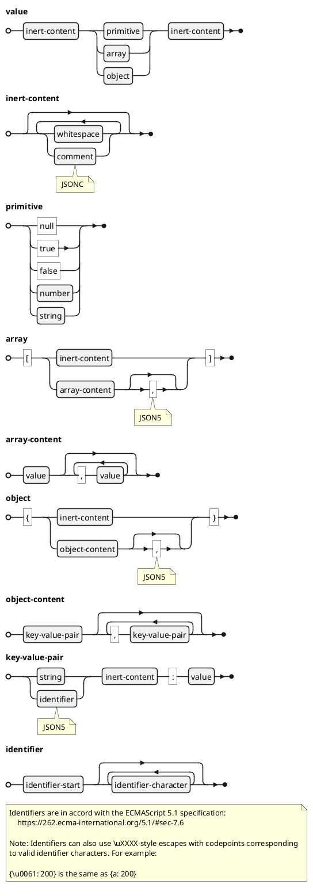
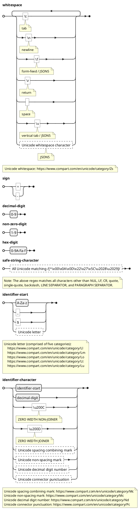
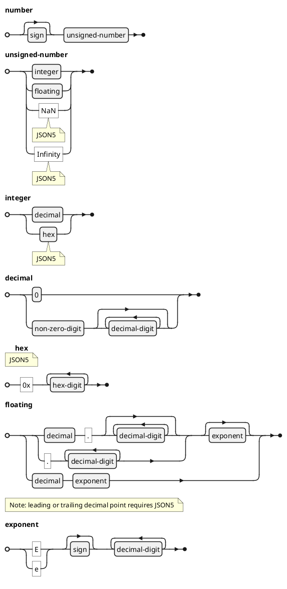
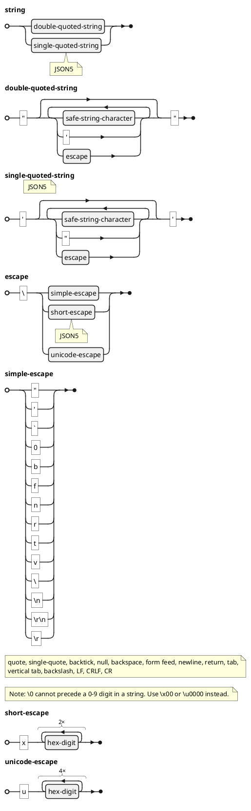
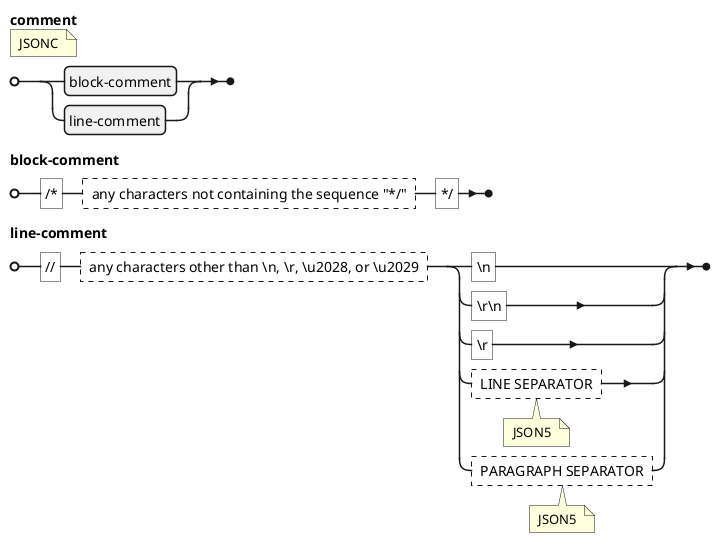

## JSON5 Grammar

Features which exceed the JSON specification are flagged with the minimal feature set required for parsing them, either JSONC or JSON5.

### Overview

### Basic character classes

### Numbers

### Strings

### Comments

